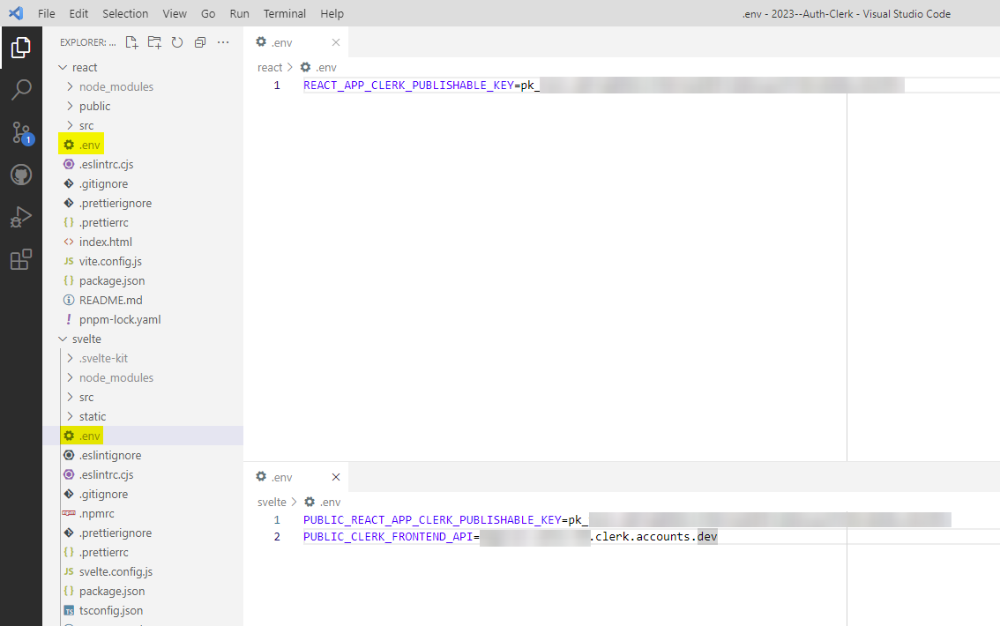

# 2023--Auth-Clerk

Trying out the Clerk auth framework with MERN and Svelte/Kit

https://clerk.com/  
https://clerk.com/docs/quickstarts/react  
https://clerk.com/docs/quickstarts/javascript

# .env files

You will be given keys after creating a project in Clerk dashboard.

